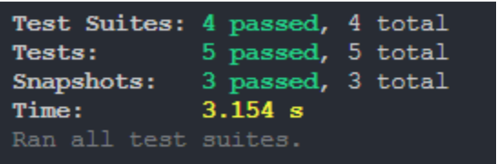
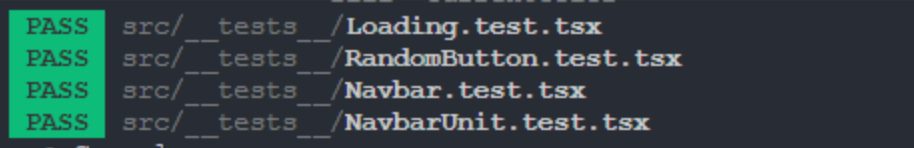
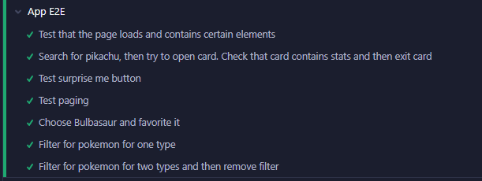

# Project 4 - Pikadex

Pikadex er en nettside som gir brukere muligheten til å søke og filtrere på hele 801 Pokemon fra generasjon 1-7. Pokemonene er fremvist på listeform, der kun en liten mengde data er synlig - navn, bilde, indeksnummer og type. Ved å trykke på en vilkårlig pokemon vil mer informasjon om den gitte pokemon dukke opp. Brukeren har også mulighet til å sortere på indeksnummer og navn alfabetisk både stigende og synkende, og antall favourites.

> Prosjektoppgave i IT2810 - Webutvikling høst 2022

### Oppgavevalg

Vi valgte å bygge videre på prosjekt 3 med fokus på følgende prosjekter:

- c. Perfeksjonere klient og backend i prosjekt 3 (passer for de som har åpenbare mangler i prosjekt 3, eller kombiner med punktet over).
- d. Bearbeide klienten i prosjekt 3 så den tilfredsstiller kravene til WAD og WCAG 2.1 (kravene som blir gjeldende fra 2023).
- e. Bearbeide klienten med fokus på bærekraft (se forelesning), metrikker og prøve ut verktøy for å måle effekt av designvalg mtp ressursbruk og datatrafikk.

## Kjøring og setup

Klon repoet med SHH/HTTPS til ønsket lokasjon.

### Klientside

Naviger til _./frontend_-mappa and kjør kommandoene under

```sh
$ npm i             # Installerer nødvendige filer

$ npm start         # Starter webapplikasjonen
```

### Serverside

Naviger til _./backend_-mappa and kjør kommandoene under

```sh
$ npm i             # Installerer nødvendige filer

$ npm start         # Starter backend-serveren
```

## Testing

Nettsiden har blitt testet i følgende nettlesere: Google Chrome, Mozilla Firefox and Microsoft Edge. Og på følgende enheter:

#### Desktops

- HP Pavilion 15,6''
- ASUS ROG FLOW X 13''
- 24’’-skjerm (horisontalt og vertikalt)
- 32’’-skjerm

#### Mobil/Tablet

- Samsung Galaxy A52s 5G
- iPhone 11
- Samsung Galaxy S7
- iPad Pro
- iPad Mini

### Snapshot-tester

Vi har generert flere snapshot-tester for å forsikre oss om at siden lastes inn riktig. Det har også blitt laget en test for sjekke at forventede elementer dukker opp på siden. Vi har i hovedsak fokusert på navbaren, ettersom det virket som Jest slet med “hex-rgb”, noe som førte til at alle tester som involverte dette ikke ville kjøre. Selv etter mange økter fortsatte dette problemet.

### Kjøring av snapshot-tester

Kjører alle testene:

```sh
$ cd frontend       # Bytte til frontend mappa

$ npm test a        # Kjører alle snapshot-testene
```





NB! For å kjøre testene må du ha [satt opp prosjektet](#kjøring-og-setup).

### Automatisert end-to-end testing med Cypress

Vi valgte å implementere automatisert testing i Cypress, noe som forsåvidt også var et krav for prosjektet. Fordelen med denne form for testing er at man får testet nettsidens funksjonalitet bedre ved å simulere en sekvens av aktiviteter som en vanlig bruker typisk ville gjort. Og det blir testet kjapt. Cypress kommer med et visuelt grensesnitt i nettleseren, i tillegg er det godt dokumentert, noe som gjør det lett å lære seg.

Vi har laget tester for å sjekke om siden lastes inn riktig. Søkefunksjonaliteten testes ved en spesifikk pokemon, og innholdet til kortet sjekkes. Videre sjekkes pagination. Til slutt sjekkes filtrering av pokemon på types.

### Kjøring av tester i Cypress

```sh
$ cd frontend               # Bytte til frontend mappa

$ npm run cypress:open      # Kjører Cypress automatisk testing
```



Et vindu vil dukke opp, hvor man har mulig til å kjøre testene i ulike browsere. Dette inkluderer Chrome, Edge og Firefox. Det er verdt å merke seg at testene stort sett fungerer, men skulle det skje en feil så burde man restarte testene for om feilen bare kan har skjedd ved et enkelttilfelle.

NB! For å kjøre testene må du ha [satt opp prosjektet](#kjøring-og-setup).

### Sortering og filtrering

Vi implementerte sorteringen, og det er nå mulig å sortere på navn (alfabetisk), ID (numerisk), og pokemon med flest favoritter. I applikasjonen vår kan man filtrere pokemon på typen deres, og slik som det er i spillet kan hver pokemon ha en primær og sekundær type. Dette betyr at når man filtrerer på typen er rekkefølgen på typene viktig. For eksempel hvis en pokemon har typene <b>Water</b> og <b>Poison</b>, og brukeren filtrerer på <b>Poison</b> og <b>Water</b>, så vil den ikke dukke opp med mindre brukeren filtrerer på <b>Water</b> og <b>Poison</b>

## Teknologier

Prosjektet er delt opp i en klient (frontend) og en server (backend) side. Disse er separert i hver sin mappe. Klienten er en _React_-webapp og serveren er en _Node_ backend, begge er skrevet i Typescript.
All dataen blir lagret i en Neo4j-database. For å hente dataen fra databasen, og vise den på klientsiden, bruker vi Apollo. Det er ikke implementert et innloggingssystem, så vi bruker derfor localstorage til å huske på om en bruker allerede har likt en pokemon. Hvis en bruker ikke allerede har likt en pokemon, vil det bli lagt til en til like på pokemonen i databasen.

Mesteparten av CSS-en til siden er skrevet fra bunnen av, men vi har brukt noe tredjepartskomponenter - hovedsakelig React Icons.

### Valg av teknologier

#### Apollo Client

Apollo client blir brukt til å cache all pokemon-dataen som blir hentet ut til klientsiden. Så dersom en pokemon blir hentet fra databasen, vil den ikke trenge å bli hentet igjen senere. Dette sparer antall kall vi gjør til databasen og gjør applikasjonen vår mer effektiv.

Global state management er også innført gjennom Apollo Client. Vår webapp bruker dette for å skille mellom tilstandene - åpnet og lukket kort. Vi bruker dette for å hindre brukeren i ha muligheten til å "tab-indeksere" seg gjennom de andre Pokemonen ([se delen om universell utforming](#universell-utforming-/-web-accessibility)), når man er inne på et kort.

#### Neo4j

Neo4j Graph Database er det valgte databasesystemet vårt. Hovedårsaken til at vi valgte Neo4j framfor MongoDB var at vi ønsket å lære mer om dette databasesystemet da enkelte på gruppa allerede hadde vært borti sistnevnte. Riktignok ville nok det naturlige valget vært MongoDB, da vi ikke hadde et stort behov for relasjoner.

## Universell utforming / web accessibility

Universell utforming / web accessibility har vært et av hovedmålene ved utviklingsprosessen. Vi har hatt "Tilsynet for universell utforming av IKT" sin tilsynsrapport i baktanke ved utformingen av siden i tillegg til kravene til WAD og WCAG 2.1. Dette har bidratt til å gjøre siden mer forståelig og robust, samt mulig å oppfatte og betjenes av folk med behov for tilpasninger grunnet nedsettelser i syn, hørsel, motorikk eller kognisjon.

Først og fremst har vi økt kontrasten flere steder. Vi brukte Chrome sitt utviklerverktøy til å sjekke kontrastnivået mellom tekst og bakgrunn. Farger ble endret på knapper, kanter, tekst og bakgrunner. Dette er et valg som vi har tatt for å bidra til å gjøre siden vår lettere å lese for de som har nedsatt synsevne.

Videre implementerte vi muligheten for navigasjon med tasturet. Dette har vi gjort ved å legge til en tabIndex til komponeneter som er nødvendige for bruken av siden. Slik kan man markere knapper, input-felt og viktig tekst ved å trykke på 'Tab', og 'Enter' for å aktivere knappene. Vi valgte å legge til denne funksjonen for å gjøre det mulig å navigere siden dersom man har motoriske vansker og ikke kan bruke mus.

For å gjøre det enda lettere å navigere siden vår med nedsatt synsevne banyttet vi oss av W3C WAI-ARIA. Vi brukte aria-label til å beskrive de forskjellige komponentene på siden. Alt som kan navigeres gjennom med tastaturet har aria-labels. Skjermlesere kan dermed lese opp navnene på komponentene, og bidrar til økt web accessibility for de med nedsatt synsevne.

## Bærekraft

Vi har gjennom hele utviklingsprosessen hatt bærekraft i tankene. Bilder og andre medier utgjør ofte de største faktorene som påvirker utslipp, og vi har derfor prøvd å minimere bruken av disse på en rekke måter.
Først og fremst har vi valgt bilder med en relativt lav oppløsning (slik de vises i selve spillet). Vi har også benyttet oss av SVG-er der det har latt seg gjøre (f.eks for ikoner, pokeballdesign i bakgrunnen, osv..). Vi bruker én GIF-fil, som ikke er det mest bærekraftige fil-formatet, men vi valgte å beholde den. I stedet kunne vi brukt en PNG

Under utviklingsprosessen har vi blant annet gjort fargene mørkere for å bidra til et lavere energiforbruk. Hovedfargene på siden er rgb(30, 30, 30) (mørkegrå bakgrunn) og rgb(66, 0, 0) (mørkerød navbar). Svart og rød er de to fargene som bruker minst energi, og en av grunnene til fargevalget vårt. Vi sparer dermed miljøet og batterinivået i samme slengen.

### Måling av datatrafikk

For å forsikre oss om at datatrafikken foregår som det skal, brukte vi nettleserens utviklerverktøy til å måle dette. Vi brukte særlig Google Chrome, og dette gjorde vi ved å åpne 'Network'-fanen i utviklerverktøyet, og trykke på 'Invert'. Når siden lastes inn, kan man se kallet som blir gjort til databasen. Dette ser man også når man bytter side. Hvis man går tilbake til en side man har lastet inn tidligere, eller søker på en pokemon som man har lastet inn tidligere, vil man ikke gjøre et kall til databasen. Da vil man heller hente ut dataene fra local cache. Vi har dermed ikke noen unødvendige kall til databasen, og datatrafikken fungerer dermed som den skal.

## Valg av API

På grunn av den enorme mengden data som er tilgjengelig, bestemte vi oss for å bruke [**PokéAPI**](https://pokeapi.co/) for å fylle databasen. APIen kan gi deg informasjon om nesten 900 forskjellige Pokémon. Dette er en flott ressurs for å utvikle webapplikasjoner og gir mange muligheter for omfattende filtrering. I tillegg er Pokemon API godt dokumentert og enkelt å bruke. Vår applikasjon kommuniserer ikke direkte med API, men alle dataene i databasen ble en gang hentet herfra og lagt i et separat repo.
